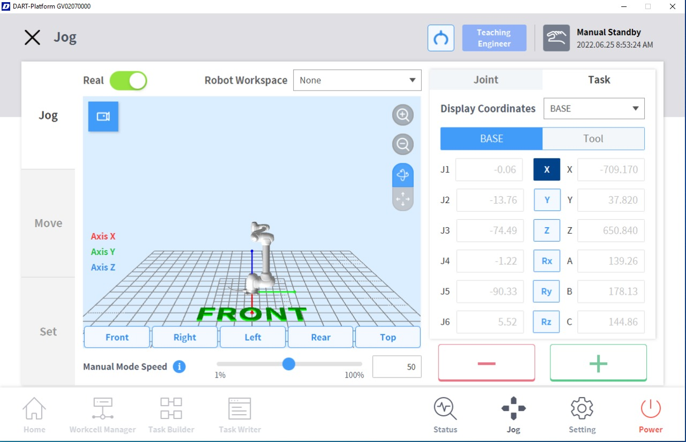
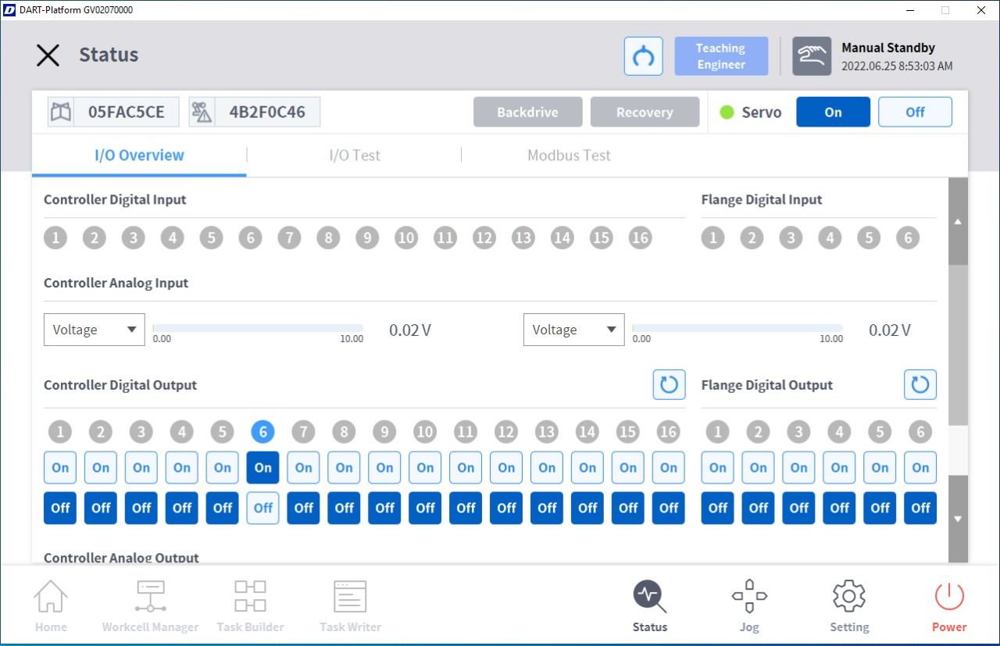
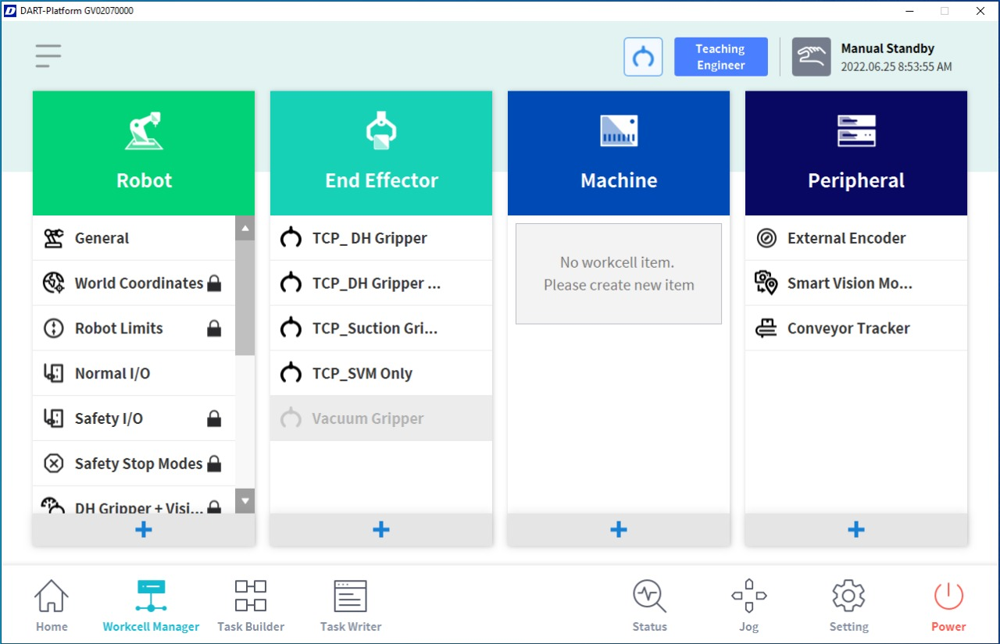
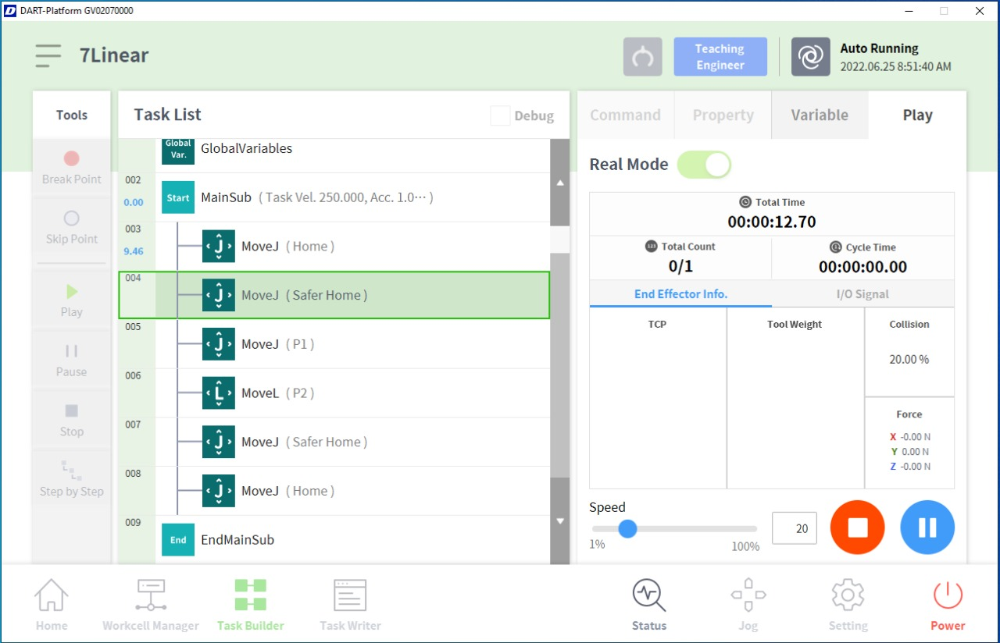
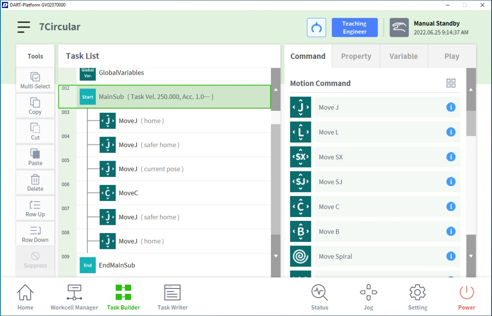
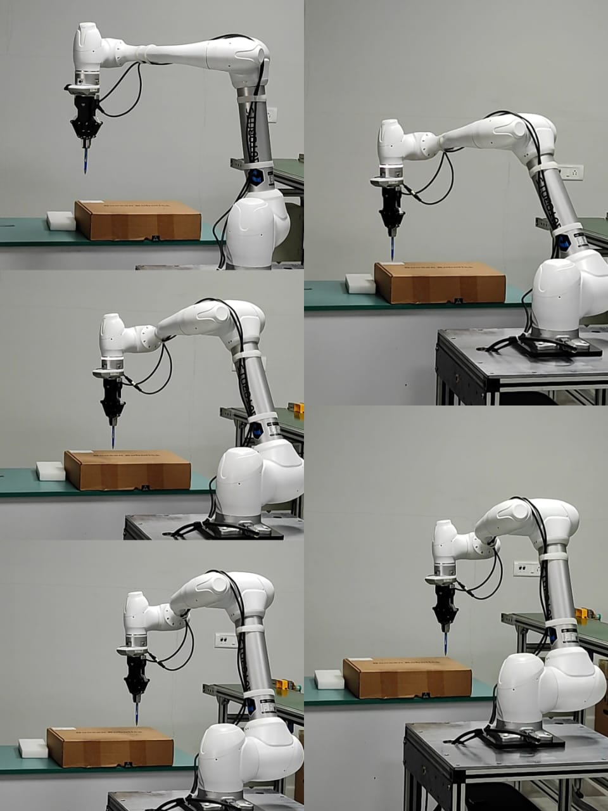
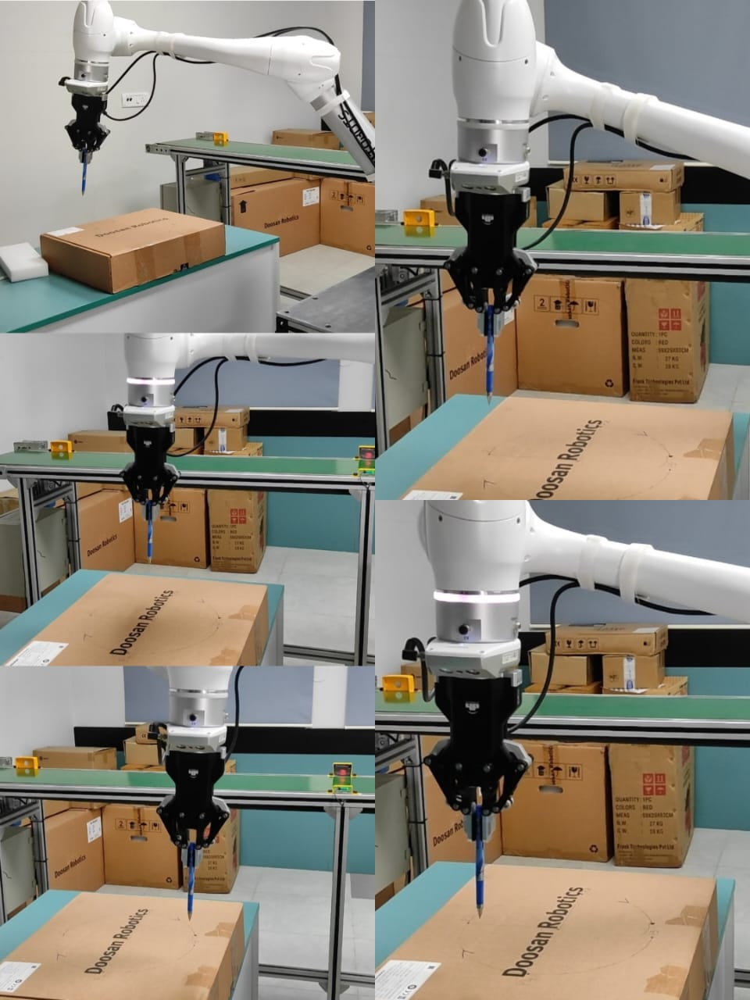

# Experiment--07-Linear-and-joint-interpolation-of-industrial-manipulator-
Program developed by : Shrruthilaya G

Register number : 212221230097
## Aim :
To understand linear and joint interpolation of industrial manipulator and develop a program for the same.
      
## Equipment Required: 
Instrial manipulator , teach pendant and associated program platform 
      
## Theory 
The following interpolation schemes are available in most of the robot controllers.
1. Joint interpolation
2. Straight line interpolation
3. Circular interpolation
4. Irregular smooth motions (manual lead through programming).
## Joint interpolation: 
The controller determines how far each joint must move to get from the first point defined in the programme to the next. It then selects the joint that
requires the longest time. This determines the amount of movement for other axes such that all the axes start and stop at the same time. Joint interpolation is the default procedure for many commercial robots.
## Straight-line interpolation: 
In this interpolation, the robot controller computes the straight-line path between two points and develops the sequence of addressable point along the path for the robot to pass through.

## Circular interpolation: 
This requires the programmer to define a circle in the
robot’s workspace. This is done by specifying three points that lie along the circle. The controller constructs the circle by selecting a series of points that lie closer to the circle. These movements are actually small straight lines. If the addressable points are dense then the linear approximation becomes very much like circle.

## Manual lead through Programming: 
When the manipulator wrist is moved by the programmer to teach, the movements consist of combination of smooth motion segments. These segments are sometimes approximately straight lines or curves or back and forth motions. These movements are referred as irregular smooth motions and an interpolation is involved to achieve them.
## Figure -01 difference between P-P , joint and linear interpolation 

## Figure -02 Jog

## Figure -03 Status

## Figure -04 Workcell Manager

## Program : 
### Linear interpolation:

### Circular interpolation:

## Robot movements: 

## Result:  
Thus ,linear and joint interpolation of industrial manipulator is executed with a suitable program.
